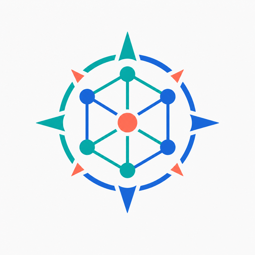

# NexaMind

<p align="center">
  
</p>

NexaMind 是一个基于大语言模型、RAG 和 MCP 的智能体应用平台。平台采用 Java 17、Spring Boot、LangChain4j 与 DDD 分层架构实现后端，使用 Next.js 和 TypeScript 构建管理界面，并通过 PostgreSQL、pgvector、RabbitMQ 与 Docker Compose 提供知识检索、异步处理和本地部署能力。

## 二次开发说明

本项目基于开源项目 [lucky-aeon/AgentX](https://github.com/lucky-aeon/AgentX) 进行学习和二次开发，遵循 Apache License 2.0。上游作者和贡献者保留其原始代码版权。

当前仓库完成了以下工程工作：

- 将产品、Java 启动类、Maven 坐标、前后端目录和运行配置统一重构为 NexaMind。
- 将 Docker 服务、容器、网络、数据库默认值及环境变量前缀统一为 `nexamind` / `NEXAMIND_`。
- 重构 Markdown 分割测试数据，使用独立的架构样例和 classpath 资源加载方式。
- 整理 Agent 创建链路、Docker Desktop 与 WSL2 调试过程及项目学习材料。
- 替换原界面品牌资产，补充 NexaMind 独立标识和个人仓库部署配置。

详细归属和修改范围见 [NOTICE.md](NOTICE.md)。

## 核心能力

- Agent 创建、配置、发布与版本管理
- 多模型服务商和模型参数管理
- MCP 工具接入、工具市场和容器隔离
- RAG 文档解析、分段、Embedding、pgvector 检索、HyDE 与 Rerank
- 对话上下文滑动窗口、摘要策略和长期记忆
- Agent 定时任务、OpenAPI、执行追踪和监控
- 账户、计费、订单与管理后台
- 网站嵌入组件和多模态配置

## 技术架构

| 层级 | 主要技术 |
| --- | --- |
| 前端 | Next.js 15、React 19、TypeScript、Tailwind CSS |
| 接口层 | Spring MVC、Bean Validation、RESTful API、WebSocket |
| 应用与领域层 | Java 17、Spring Boot 3、DDD、MyBatis-Plus、LangChain4j |
| 数据与中间件 | PostgreSQL 15、pgvector、RabbitMQ、S3 兼容对象存储 |
| AI 应用 | Agent、Prompt、MCP、Tool Calling、RAG、Embedding、Rerank |
| 工程部署 | Maven、Docker、Docker Compose、GitHub Actions |

## 项目结构

```text
nexamind/
├── NexaMind/              # Spring Boot 后端
├── nexamind-frontend/     # Next.js 前端
├── deploy/                # 本地和开发环境 Docker Compose
├── docker/                # 前后端镜像定义
├── production/            # 生产环境部署配置
├── docs/                  # 架构、计费、监控和调试文档
├── .env.example           # 环境变量模板
└── Dockerfile             # 一体化镜像构建文件
```

## 快速开始

### 环境要求

- JDK 17
- Node.js 20+
- Docker Desktop 或 Docker Engine
- Docker Compose v2

### Docker Compose

```bash
git clone https://github.com/letmeseeseeee/nexamind.git
cd nexamind/deploy
cp .env.local.example .env
docker compose --profile local --profile dev up -d --build
```

Windows 也可以在 `deploy` 目录运行：

```powershell
.\start.bat
```

默认服务地址：

| 服务 | 地址 |
| --- | --- |
| 前端 | http://localhost:3000 |
| 后端 API | http://localhost:8088/api |
| PostgreSQL | localhost:5432 |
| RabbitMQ 管理界面 | http://localhost:15672 |
| Adminer | http://localhost:8082 |

开发环境默认账户仅用于本地测试：

- 管理员：`admin@nexamind.local` / `admin123`
- 测试用户：`test@nexamind.local` / `test123`

生产环境部署前必须修改默认密码、数据库密码和 `JWT_SECRET`。

## 本地开发

后端：

```powershell
cd NexaMind
.\mvnw.cmd -DskipTests package
.\mvnw.cmd spring-boot:run -Dspring-boot.run.profiles=dev
```

前端：

```powershell
cd nexamind-frontend
npm install
npm run dev
```

## 验证命令

```powershell
cd NexaMind
.\mvnw.cmd test
.\mvnw.cmd spotless:check

cd ..\nexamind-frontend
npm run build

cd ..\deploy
docker compose --profile local --profile dev config
```

## 配置说明

复制根目录 `.env.example` 或 `deploy` 下对应环境模板，并重点修改：

- `JWT_SECRET`
- `DB_PASSWORD`
- `RABBITMQ_PASSWORD`
- `NEXAMIND_ADMIN_PASSWORD`
- 模型、Embedding 与 Rerank 服务密钥
- S3 兼容对象存储配置

不要提交 `.env`、访问令牌、模型密钥或生产环境配置。

## 文档

- [开发部署说明](deploy/README.md)
- [Agent 设计说明](docs/agent_design.md)
- [Token 溢出策略](docs/token_overflow_strategy.md)
- [容器管理设计](NexaMind/docs/container-management.md)
- [长期记忆表结构](NexaMind/docs/memory_schema.md)
- [Docker Desktop 与 WSL2 调试记录](docs/docker-desktop-wsl2-debug-record-2026-05-18.zh-CN.md)

## 许可证

本项目按照 [Apache License 2.0](LICENSE) 发布。使用和分发衍生版本时，请保留许可证、版权和上游归属说明。
