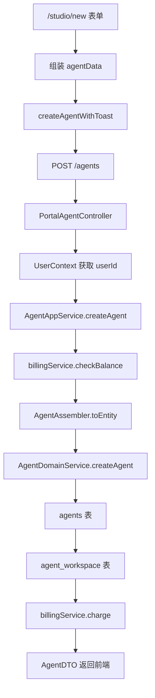

# Agent 创建流程学习卡

配套可视化图：

手机优先打开 PNG：`F:\ai_agent\nexamind\docs\agent-create-flow-visual.zh-CN.png`。SVG 保留为可编辑源文件。

## 一句话理解

前端收集 Agent 配置，调用 `POST /agents`；后端用登录态确认用户，检查余额，把请求转换成 `AgentEntity`，写入 `agents` 表，再创建 `agent_workspace` 记录，扣费后返回 `AgentDTO`。

## 主流程



## 源码速查

| 步骤 | 作用 | 文件 |
|---|---|---|
| 1 | 创建页入口，接收表单提交 | [studio/new/page.tsx](F:/ai_agent/nexamind/nexamind-frontend/app/(main)/studio/new/page.tsx) |
| 2 | 表单弹窗，收集 Agent 信息 | [agent-form-modal.tsx](F:/ai_agent/nexamind/nexamind-frontend/components/agent-form-modal.tsx) |
| 3 | 前端表单状态结构 | [use-agent-form.ts](F:/ai_agent/nexamind/nexamind-frontend/hooks/use-agent-form.ts) |
| 4 | 前端请求类型 | [agent.ts](F:/ai_agent/nexamind/nexamind-frontend/types/agent.ts) |
| 5 | API 封装，发送 `POST /agents` | [agent-service.ts](F:/ai_agent/nexamind/nexamind-frontend/lib/agent-service.ts) |
| 6 | 接口路径常量 | [api-config.ts](F:/ai_agent/nexamind/nexamind-frontend/lib/api-config.ts) |
| 7 | 后端 Controller 入口 | [PortalAgentController.java](F:/ai_agent/nexamind/NexaMind/src/main/java/org/xhy/interfaces/api/portal/agent/PortalAgentController.java) |
| 8 | 创建请求 DTO，校验 `name` | [CreateAgentRequest.java](F:/ai_agent/nexamind/NexaMind/src/main/java/org/xhy/interfaces/dto/agent/request/CreateAgentRequest.java) |
| 9 | 应用服务，编排创建、计费、工作区 | [AgentAppService.java](F:/ai_agent/nexamind/NexaMind/src/main/java/org/xhy/application/agent/service/AgentAppService.java) |
| 10 | Request/Entity/DTO 转换 | [AgentAssembler.java](F:/ai_agent/nexamind/NexaMind/src/main/java/org/xhy/application/agent/assembler/AgentAssembler.java) |
| 11 | Agent 领域实体，对应 `agents` 表 | [AgentEntity.java](F:/ai_agent/nexamind/NexaMind/src/main/java/org/xhy/domain/agent/model/AgentEntity.java) |
| 12 | 领域服务，调用 Repository 落库 | [AgentDomainService.java](F:/ai_agent/nexamind/NexaMind/src/main/java/org/xhy/domain/agent/service/AgentDomainService.java) |
| 13 | 工作区实体，对应 `agent_workspace` 表 | [AgentWorkspaceEntity.java](F:/ai_agent/nexamind/NexaMind/src/main/java/org/xhy/domain/agent/model/AgentWorkspaceEntity.java) |

## 请求字段

前端会组装：

```ts
{
  name,
  avatar,
  description,
  systemPrompt,
  welcomeMessage,
  toolIds,
  knowledgeBaseIds,
  toolPresetParams,
  multiModal
}
```

后端 `CreateAgentRequest` 重点字段：

```java
@NotBlank
private String name;
private String systemPrompt;
private String welcomeMessage;
private List<String> toolIds;
private List<String> knowledgeBaseIds;
private Map<String, Map<String, Map<String, String>>> toolPresetParams;
private Boolean multiModal;
```

## 关键业务点

- 创建者以后端 `UserContext.getCurrentUserId()` 为准，不信任前端传来的 `userId`。
- 创建前会走 `billingService.checkBalance` 检查余额。
- `AgentAssembler.toEntity` 会设置 `enabled = true`，所以 Agent 创建后默认启用。
- Agent 本体写入 `agents` 表。
- 创建成功后会自动写入 `agent_workspace`，把 Agent 加到用户工作区。
- 创建成功后会调用 `billingService.charge` 扣费。

## 容易混淆的点

前端创建时传了 `modelConfig`，但后端 `CreateAgentRequest` 没有这个字段。也就是说，创建 Agent 时它不会直接进入 `agents` 表。

后端真正做的是：

```java
new AgentWorkspaceEntity(agent.getId(), userId, new LLMModelConfig())
```

也就是先创建默认工作区模型配置。后续具体模型配置更可能通过工作区相关接口单独保存。

## 学习顺序

1. 先看前端 `studio/new/page.tsx`，理解表单怎么提交。
2. 再看 `agent-service.ts`，理解 API 怎么封装。
3. 看 `PortalAgentController`，理解 REST 接口入口。
4. 看 `AgentAppService.createAgent`，理解业务编排。
5. 看 `AgentAssembler`，理解字段映射。
6. 看 `AgentEntity` 和 `AgentWorkspaceEntity`，理解数据库模型。
7. 看 `AgentDomainService`，理解最终落库。
